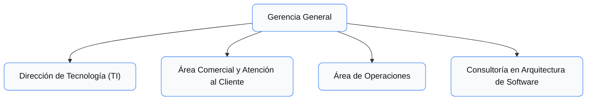

# 3. Contexto

## Actores Externos

- **Ciudadanos:** Usuarios finales que acceden a la aplicación móvil y al portal web para gestionar sus servicios.  
- **Alcaldía de Cali:** Entidad reguladora y promotora de la estrategia “Cali Conectada”.  
- **Pasarelas de Pago:** Plataformas externas que permiten pagos en línea y conciliación inmediata.  
- **Proveedores de Telecomunicaciones y Energía Solar:** Competencia emergente que presiona a ServiCiudad a modernizarse.  

## Relación con Sistemas Legados

- **Mainframe de Energía (IBM Z):** Maneja consumo y facturación de energía. No expone APIs, solo accesible mediante procesos batch y conector 3270.  
- **Base de Datos Oracle en Solaris (Acueducto):** Genera reportes de facturación en texto de ancho fijo.  
- **Sistemas de Telecomunicaciones:** Infraestructura más moderna, pero con integración deficiente.  
- **Procesos Batch:** Actualmente sincronizan datos entre sistemas usando archivos planos (TXT, CSV, EBCDIC).

## Organigrama del Proyecto

El proyecto contará con la participación de las siguientes áreas:  

