# 3. Contexto

## Actores Externos

- **Ciudadanos:** Usuarios finales que acceden a la aplicación móvil y al portal web para gestionar sus servicios.  
- **Alcaldía de Cali:** Entidad reguladora y promotora de la estrategia “Cali Conectada”.  
- **Pasarelas de Pago:** Plataformas externas que permiten pagos en línea y conciliación inmediata.  
- **Proveedores de Telecomunicaciones y Energía Solar:** Competencia emergente que presiona a ServiCiudad a modernizarse.  

## Relación con Sistemas Legados

- **Mainframe de Energía (IBM Z):** Maneja consumo y facturación de energía. No expone APIs, solo accesible mediante procesos batch y conector 3270.  
- **Base de Datos Oracle en Solaris (Acueducto):** Genera reportes de facturación en texto de ancho fijo.  
- **Sistemas de Telecomunicaciones:** Infraestructura más moderna, pero con integración deficiente.  
- **Procesos Batch:** Actualmente sincronizan datos entre sistemas usando archivos planos (TXT, CSV, EBCDIC).

## Organigrama del Proyecto

La empresa cuenta con las siguientes areas dentro de si misma:  

```mermaid
flowchart TB
  %% ORGANIGRAMA SERVICIUDAD - "ServiCiudad Conectada"
  classDef cSuite fill:#F2F6FF,stroke:#3B82F6,stroke-width:1px,color:#111,rx:8,ry:8;
  classDef dir fill:#F8FAFC,stroke:#334155,stroke-width:1px,rx:6,ry:6;
  classDef area fill:#FFFFFF,stroke:#94A3B8,rx:6,ry:6,color:#111;
  classDef lead fill:#FFFFFF,stroke:#CBD5E1,stroke-dasharray:3 2,rx:6,ry:6,color:#111;

  CEO["CEO<br/>Laura Restrepo"]:::cSuite

  %% Primer nivel
  CEO --> LEGAL["Dirección Jurídica & Cumplimiento<br/>Ricardo Abril (Oficial de Cumplimiento)"]:::dir
  CEO --> OTD["Dirección de Transformación Digital (OTD)<br/>Mateo Pardo"]:::dir
  CEO --> COO["Dirección de Operaciones (COO)<br/>María Fernanda Ospina"]:::dir
  CEO --> CIO["Dirección de Tecnología (CIO)<br/>Andrés Gil"]:::dir

  %% PMO bajo OTD
  OTD --> PMO["PMO / Programa ServiCiudad Conectada<br/>Valentina Quintero (PMO Lead)"]:::area

  %% Operaciones
  COO --> ATC["Atención al Cliente & Facturación<br/>Jorge Castellanos"]:::area
  COO --> CAMPO["Gestión de Campo (red eléctrica/agua)<br/>Luis Miguel Correa"]:::area

  %% Tecnología bajo CIO
  CIO --> CTO["Arquitectura & Desarrollo (CTO)<br/>Santiago Vélez"]:::area
  CIO --> INFRA["Infraestructura & Plataformas<br/>Camila Rojas"]:::area
  CIO --> SEG["Seguridad de la Información (CISO)<br/>Diana Pineda"]:::area
  CIO --> MESA["Mesa de Servicios (N1/N2)<br/>Miguel Ángel Rueda"]:::area

  %% Detalle CTO
  CTO --> ARQ["Arquitectura de Solución<br/>Eliana Duarte (Arquitecta)"]:::lead
  CTO --> MSFACT["Líder Microservicios - Facturación<br/>Héctor Riaño"]:::lead
  CTO --> MSCLI["Líder Microservicios - Clientes/Notificaciones<br/>Ana María Páez"]:::lead
  CTO --> QA["QA / Testing Lead<br/>Carlos Medina"]:::lead

  %% Detalle Infra
  INFRA --> DEVOPS["DevOps / SRE Lead<br/>Julián Torres"]:::lead
  INFRA --> DBA["DBA Lead<br/>Paula Castaño"]:::lead
  INFRA --> LEGADOS["Administrador Mainframe/Legados<br/>Óscar Barreto"]:::lead

  %% Detalle Seguridad
  SEG --> DPO["Oficial de Privacidad (DPO)<br/>Natalia Ibargüen"]:::lead
  SEG --> ANALISTA["Analista de Seguridad<br/>Kevin Montoya"]:::lead
  SEG --> AUDIT["Auditor Interno de TI<br/>Silvia Calderón"]:::lead

  %% Comité de Seguridad (vínculos punteados)
  classDef committee stroke-dasharray:5 3,fill:#FFF7ED,stroke:#F59E0B,rx:8,ry:8;
  COMITE["Comité de Seguridad (SGSI)<br/>CISO (preside), CEO, CIO, DPO, Jurídica, PMO, Arquitectura, COO"]:::committee
  COMITE -.-> CEO
  COMITE -.-> SEG
  COMITE -.-> CIO
  COMITE -.-> LEGAL
  COMITE -.-> PMO
  COMITE -.-> ARQ
  COMITE -.-> COO


```

  ------------------------------------------------------------------------------------------------------------------------------------------------------------------
  Sistema / Activo           P-CLI       P-BIZ   P-SOP1         P-SOP2          P-DEV         P-PLAT        P-DBA   P-LEG         P-SEC          P-AUD         P-DPO
  ----------------------- -------- ----------- -------- -------------- -------------- -------------- ------------ ------- ------------- -------------- -------------
  **App Móvil / Portal**     R/C/U       R/C/U        R              R    R (sandbox)    A (SSO/WAF)           --      --    R (pruebas              R       R (solo
                            propio     dominio                                                                                    seg.)                  privacidad)

  **API Gateway**               --           R        R              R   R (DEV/TEST)          **A**           --      --     R/Auditar              R            --

  **Microservicios              -- C/U dominio        R   X (runbooks)   X (DEV/TEST)            X/A           --      --             R              R R (PII seudo)
  (Clientes, Facturación,                                                               (plataforma)                                                   
  Pagos, Notif.)**                                                                                                                                     

  **Broker de Mensajes          --           R        R X (reintentos)   X (DEV/TEST)          **A**           --      --             R              R            --
  (Pub/Sub)**                                                                                                                                          

  **Data Lake/Warehouse**       -- R (reportes       --             --             --      A (infra)     A (motor      --      R (logs)              R         **R a
                                         de su                                                         analítico)                                           datasets
                                      dominio)                                                                                                               seudo**

  **DB de Producción**          --          --       --             --             --             --        **A**      -- R (auditoría)  R (metadatos)            --

  **Mainframe/Legados**         --          --       --             --             --             --           --   **A**   R (monitor) R (evidencias)            --

  **Observabilidad              --  R (paneles    **R**          **R**    R (no prod)          **A**            R       R         **A**          **R**        R (con
  (SIEM/APM/Logs)**                de negocio)                                                                                                              seudon.)

  **Repos/CI-CD (Git,           --          --       --             --          **A/X          **A**            R      --             R              R            --
  Artefactory,                                                           (DEV/TEST)**                                                                  
  Pipelines)**                                                                                                                                         

  **Gestión de                  --          --       --             --             --          **A**            R       R         **A**              R             R
  identidades                                                                                                                                          
  (IAM/SSO/Vault)**                                                                                                                                    
  ------------------------------------------------------------------------------------------------------------------------------------------------------------------

