# 3. Contexto

## Actores Externos

- **Ciudadanos:** Usuarios finales que acceden a la aplicación móvil y al portal web para gestionar sus servicios.  
- **Alcaldía de Cali:** Entidad reguladora y promotora de la estrategia “Cali Conectada”.  
- **Pasarelas de Pago:** Plataformas externas que permiten pagos en línea y conciliación inmediata.  
- **Proveedores de Telecomunicaciones y Energía Solar:** Competencia emergente que presiona a ServiCiudad a modernizarse.  

## Relación con Sistemas Legados

- **Mainframe de Energía (IBM Z):** Maneja consumo y facturación de energía. No expone APIs, solo accesible mediante procesos batch y conector 3270.  
- **Base de Datos Oracle en Solaris (Acueducto):** Genera reportes de facturación en texto de ancho fijo.  
- **Sistemas de Telecomunicaciones:** Infraestructura más moderna, pero con integración deficiente.  
- **Procesos Batch:** Actualmente sincronizan datos entre sistemas usando archivos planos (TXT, CSV, EBCDIC).

## Organigrama del Proyecto

La empresa cuenta con las siguientes areas dentro de si misma:  

```mermaid
flowchart TB
  %% ORGANIGRAMA SERVICIUDAD - "ServiCiudad Conectada"
  classDef cSuite fill:#F2F6FF,stroke:#3B82F6,stroke-width:1px,color:#111,rx:8,ry:8;
  classDef dir fill:#F8FAFC,stroke:#334155,stroke-width:1px,rx:6,ry:6;
  classDef area fill:#FFFFFF,stroke:#94A3B8,rx:6,ry:6,color:#111;
  classDef lead fill:#FFFFFF,stroke:#CBD5E1,stroke-dasharray:3 2,rx:6,ry:6,color:#111;

  CEO["CEO<br/>Laura Restrepo"]:::cSuite

  %% Primer nivel
  CEO --> LEGAL["Dirección Jurídica & Cumplimiento<br/>Ricardo Abril (Oficial de Cumplimiento)"]:::dir
  CEO --> OTD["Dirección de Transformación Digital (OTD)<br/>Mateo Pardo"]:::dir
  CEO --> COO["Dirección de Operaciones (COO)<br/>María Fernanda Ospina"]:::dir
  CEO --> CIO["Dirección de Tecnología (CIO)<br/>Andrés Gil"]:::dir

  %% PMO bajo OTD
  OTD --> PMO["PMO / Programa ServiCiudad Conectada<br/>Valentina Quintero (PMO Lead)"]:::area

  %% Operaciones
  COO --> ATC["Atención al Cliente & Facturación<br/>Jorge Castellanos"]:::area
  COO --> CAMPO["Gestión de Campo (red eléctrica/agua)<br/>Luis Miguel Correa"]:::area

  %% Tecnología bajo CIO
  CIO --> CTO["Arquitectura & Desarrollo (CTO)<br/>Santiago Vélez"]:::area
  CIO --> INFRA["Infraestructura & Plataformas<br/>Camila Rojas"]:::area
  CIO --> SEG["Seguridad de la Información (CISO)<br/>Diana Pineda"]:::area
  CIO --> MESA["Mesa de Servicios (N1/N2)<br/>Miguel Ángel Rueda"]:::area

  %% Detalle CTO
  CTO --> ARQ["Arquitectura de Solución<br/>Eliana Duarte (Arquitecta)"]:::lead
  CTO --> MSFACT["Líder Microservicios - Facturación<br/>Héctor Riaño"]:::lead
  CTO --> MSCLI["Líder Microservicios - Clientes/Notificaciones<br/>Ana María Páez"]:::lead
  CTO --> QA["QA / Testing Lead<br/>Carlos Medina"]:::lead

  %% Detalle Infra
  INFRA --> DEVOPS["DevOps / SRE Lead<br/>Julián Torres"]:::lead
  INFRA --> DBA["DBA Lead<br/>Paula Castaño"]:::lead
  INFRA --> LEGADOS["Administrador Mainframe/Legados<br/>Óscar Barreto"]:::lead

  %% Detalle Seguridad
  SEG --> DPO["Oficial de Privacidad (DPO)<br/>Natalia Ibargüen"]:::lead
  SEG --> ANALISTA["Analista de Seguridad<br/>Kevin Montoya"]:::lead
  SEG --> AUDIT["Auditor Interno de TI<br/>Silvia Calderón"]:::lead

  %% Comité de Seguridad (vínculos punteados)
  classDef committee stroke-dasharray:5 3,fill:#FFF7ED,stroke:#F59E0B,rx:8,ry:8;
  COMITE["Comité de Seguridad (SGSI)<br/>CISO (preside), CEO, CIO, DPO, Jurídica, PMO, Arquitectura, COO"]:::committee
  COMITE -.-> CEO
  COMITE -.-> SEG
  COMITE -.-> CIO
  COMITE -.-> LEGAL
  COMITE -.-> PMO
  COMITE -.-> ARQ
  COMITE -.-> COO


```

### Estructura del Organigrama

- **Junta Directiva**
  - **Gerente General (CEO)**: Laura Restrepo
  - **Dirección Jurídica & Cumplimiento**: Ricardo Abril (Oficial de Cumplimiento)
  - **Dirección de Transformación Digital (OTD)**: Mateo Pardo
    - **Oficina de PMO / Programa ServiCiudad Conectada**: Valentina Quintero (PMO Lead)
  - **Dirección de Operaciones (COO)**: María Fernanda Ospina
    - **Atención al Cliente & Facturación**: Jorge Castellanos
    - **Gestión de Campo (red eléctrica/agua)**: Luis Miguel Correa
  - **Dirección de Tecnología (CIO)**: Andrés Gil
    - **Arquitectura & Desarrollo (CTO)**: Santiago Vélez
      - **Arquitecto de Solución**: Eliana Duarte
      - **Líder Microservicios (Facturación)**: Héctor Riaño
      - **Líder Microservicios (Clientes/Notificaciones)**: Ana María Páez
      - **QA/Testing Lead**: Carlos Medina
  - **Infraestructura & Plataformas**: Camila Rojas
    - **DevOps/SRE Lead**: Julián Torres
    - **DBA Lead**: Paula Castaño
    - **Administrador Mainframe/Legados**: Óscar Barreto
  - **Seguridad de la Información (CISO)**: Diana Pineda
    - **Oficial de Privacidad (DPO)**: Natalia Ibargüen
    - **Analista de Seguridad**: Kevin Montoya
    - **Auditor Interno de TI**: Silvia Calderón
  - **Mesa de Servicios (N1/N2)**: Miguel Ángel Rueda

**Comité de Seguridad (SGSI)**: CEO, CIO, CISO (preside), DPO, Jurídica, PMO, Arquitecto de Solución, COO.

## Servicio Orquestador
El servicio que debe orquestar los demás es un Orchestrator/Facade llamado TransaccionesOrchestratorService.

Funciones principales:

- Orquestar casos de uso compuestos:

- Ejemplo: "Realizar pago en línea" → valida usuario (AuthService) → consulta saldo (SaldoService) → registra transacción (PagoService) → audita operación (AuditoriaService).

- Gestionar flujo de negocio de extremo a extremo (E2E).

- Aplicar la capa anticorrupción para comunicarse con el mainframe y exponer solo los datos necesarios de forma limpia.

- Centralizar seguridad y validaciones cross-cutting.

- Coordinar notificaciones al usuario (confirmación de pago, saldo actualizado).
